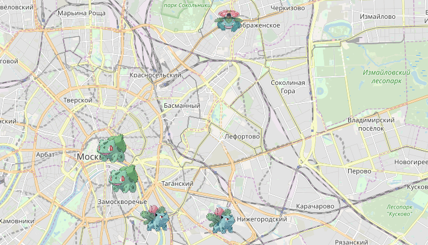

# Карта покемонов



## Предметная область
Сайт для помощи по игре [Pokemon GO](https://www.pokemongo.com/en-us/). Это игра про ловлю [покемонов](https://ru.wikipedia.org/wiki/%D0%9F%D0%BE%D0%BA%D0%B5%D0%BC%D0%BE%D0%BD).

Суть игры в том, что на карте периодически появляются покемоны, на определённый промежуток времени. Каждый игрок может поймать себе покемона, и пополнить свою личную коллекцию.

На карте может быть сразу несколько особей одного и того же покемона: например, 3 Бульбазавра. Каждую особь могут поймать сразу несколько игроков. Если игрок поймал себе особь покемона, она исчезает для него, но остаётся для других.

В игре есть механика эволюции. Покемон одного вида может "эволюционировать" в другого. Так, например, Бульбазавр превращается в Ивизавра, а тот превращается в Венузавра.


## Setup
1. Clone project
```
git clone https://github.com/Gennadynemchin/pokemon-map.git
cd pokemon-map
```

2. Create virtual environment
```
python -m venv venv
source venv/bin/activate
```

3. Install requirements
```
pip install -r requirements.txt
```

4. Create database
```
python manage.py migrate
```

5. Create Django superuser
```
python manage.py createsuperuser
```

6. Run local server
```
python manage.py runserver
```

7. Open `Pokemon map` at [http://127.0.0.1:8000/](http://127.0.0.1:8000/)

8. Open `admin` panel at [http://127.0.0.1:8000/admin](http://127.0.0.1:8000/admin)